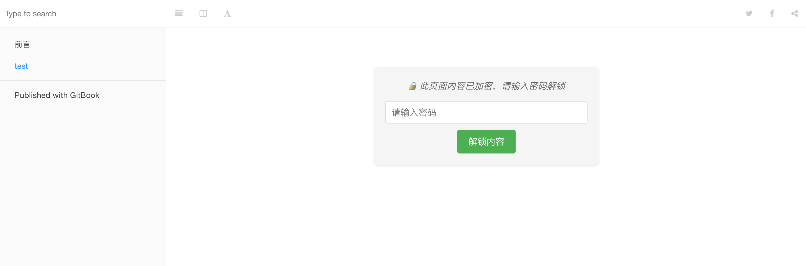

## gitbook-plugin-password-pro

`GitBook` 单页面加密插件

### 效果



### 使用

```
{
  "plugins": ["aes-page-encrypt"],
  "pluginsConfig": {
    "aes-page-encrypt": {
      "pages": {
        "1.md": "123456789"
      }
    }
  }
}
```

### 作用

- 通过 `book.json` 中配置密码，可以做到对 `GitBook` 的单独页面进行加密

### 原理

- 内容加密: 在 `GitBook` 构建过程中，插件会检查配置文件中指定需要加密的页面。对于这些页面，插件使用`AES`（高级加密标准）算法对页面内容进行加密。加密过程使用用户提供的密码生成密钥，确保内容的安全性。
- 页面内容替换: 插件将原始页面内容替换为加密后的内容，同时注入必要的 `HTML 结构`、`CSS 样式`和 `JavaScript 代码`。这些注入的元素包括密码输入框、解密按钮和用于显示解密内容的容器。
- 客户端解密: 当用户访问加密页面时，他们会看到一个密码输入界面。输入密码并点击解锁按钮后，浏览器中的 `JavaScript 代码` 会尝试使用输入的密码解密内容。
- 动态内容展示: 如果密码正确，解密后的内容会动态地显示在页面上，替换原来的密码输入界面。如果密码错误，则会显示错误消息。

### 缺陷

由于 `GitBook` 的机制问题，在页面加载的过程中会暴漏密码，具体体现在页面的 `gitbook.page.hasChanged`。

### to-do-list

|目标|完成情况|
|---|---|
|npm发布|❎|
|密码暴漏缺陷|❎|
|页面密码记忆|❎|

